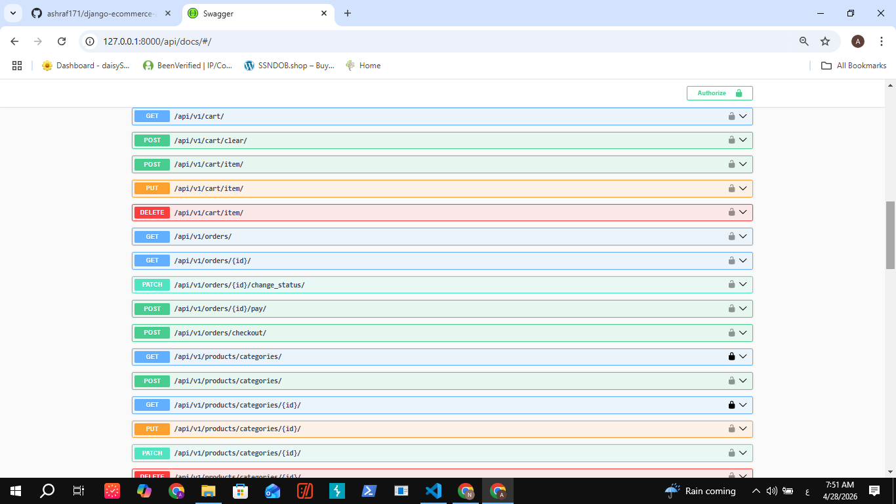

# E-commerce API (Django + DRF)

A RESTful backend API for an e-commerce system with secure checkout, stock management, and structured order processing.

Built with Django and Django REST Framework.

---

## Features

* JWT authentication (SimpleJWT)
* User management using Djoser
* Product and category management
* Cart system (add, update, delete, clear)
* Checkout process with stock validation
* Order system with status management
* Cancel order with stock restoration
* Filtering, search, and ordering
* Fake payment endpoint for simulating order payment
* Permission handling (user vs admin)
* Automated tests (25 tests)

---

## Tech Stack

* Python
* Django
* Django REST Framework
* PostgreSQL
* Djoser
* SimpleJWT

---

## API Structure

### Authentication

* POST `/api/v1/auth/users/` – register
* POST `/api/v1/auth/jwt/create/` – login
* POST `/api/v1/auth/jwt/refresh/` – refresh token
* GET `/api/v1/auth/users/me/` – current user

---

### Profile

* GET `/api/v1/users/profile/`
* PUT `/api/v1/users/profile/`

---

### Products

* GET `/api/v1/products/`

Supports:

* search: `?search=iphone`
* filtering: `?min_price=100&max_price=500`
* category: `?category=electronics`
* ordering: `?ordering=-price`

---

### Cart

* GET `/api/v1/cart/`
* POST `/api/v1/cart/items/`
* PUT `/api/v1/cart/items/`
* DELETE `/api/v1/cart/items/`
* POST `/api/v1/cart/clear/`

---
### Orders

- GET `/api/v1/orders/`
- GET `/api/v1/orders/{id}/`
- POST `/api/v1/orders/{id}/pay/`
- PATCH `/api/v1/orders/{id}/change_status/`
---

## Order Status Flow

Valid transitions:

```
PENDING → PAID → SHIPPED → DELIVERED
PENDING → CANCELED
PAID → CANCELED
```

Invalid transitions are blocked.

---
### Payment Flow

- Orders are created with `PENDING` status.
- A pending order can be paid using:
- POST `/api/v1/orders/{id}/pay/`
- After successful payment, the order status becomes `PAID`.
- Paid orders can then be shipped by admin.

## Quick Start
## Installation

```bash
git clone <your-repo-url>
cd E_commerce
python -m venv venv
venv\Scripts\activate
pip install -r requirements.txt
```

---

## Database

```bash
python manage.py migrate
```

---

## Run Server

```bash
python manage.py runserver
```

---

## Run Tests

```bash
python manage.py test
```

---

## Notes

* Checkout is wrapped in database transactions to avoid inconsistent data
* Stock updates are handled safely to prevent race conditions
* Permissions are enforced so users can only access their own data

---

## Future Improvements

* Payment integration
* API documentation (Swagger)
* Docker setup


## API Documentation

Swagger UI:

